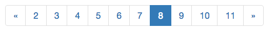

# Ember-simple-pagination

[](https://travis-ci.org/twbrandt/ember-simple-pagination)
[](https://codeclimate.com/github/twbrandt/ember-simple-pagination)
[](https://raw.githubusercontent.com/twbrandt/ember-simple-pagination/master/LICENSE.md)

This Ember addon is a simple pagination component which uses Twitter Bootstrap markup. It works with both server-side and client-side pagination.



## Installation
* Ember.js v3.24 or above
* Node.js v14 or above

`ember install ember-simple-pagination`

## Usage

In your templates:

```
<SimplePagination
  @recordCount={{this.recordCount}}
  @pageSize={{this.pageSize}}
  @pageNumber={{this.pageNumber}}
  @maxPagesInList={{this.maxPagesInList}}
  @onPageSelect={{this.externalAction}}
/>
```
### Arguments
- `recordCount`: The total number records in the collection being paginated.
- `pageSize`: The number of records in each page.
- `pageNumber`: The current page number. Note that page numbers begin at `1`, not `0`.
- `maxPagesInList`: The maximum of page numbers to display. Defaults to 10.

### Events
`onPageSelect`: This fires when the user clicks a page number link, or the `next page` or `previous page` links. It will invoke the external action specified. The page number selected by the user will be passed to the action. The action is not invoked if the user selects the current page link, or the `previous page` link if the current page === 1, or the `next page` link if the current page === the total number of pages.

## Example

This example assumes the Ember `JSONAPIAdapter` and on the server `JSONAPI::Resources`.

`app/components/display-posts.js`:
```javascript
import Component from '@glimmer/component';
import { query } from 'ember-data-resources';
import { tracked } from '@glimmer/tracking';
import { action } from '@ember/object';

export default class Example extends Component {
    @tracked pageNumber = 1;
    @tracked pageSize = 20;

    posts = query(this, 'post', () => ({ pageSize: this.pageSize, pageNumber: this.pageNumber }));

    @action
    changePage(pageNumber) {
      this.pageNumber = pageNumber;
    }
}
```

`app/templates/components/display-posts.hbs`:
```html
<ul class="list-unstyled">
  {{#if this.posts.isLoading}}
    ...loading
  {{else if this.posts.records}}
    {{#each this.posts as |post|}}
      <li>{{post.title}}</li>
    {{/each}}
  {{/if}}
</ul>

<SimplePagination
  @recordCount={{this.posts.records.meta.total}}
  @pageSize={{this.pageSize}}
  @pageNumber={{this.pageNumber}}
  @maxPagesInList={{10}}
  @onPageSelect={{this.changePage}}
/>
```
